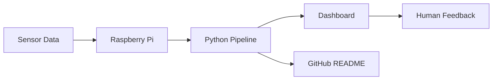
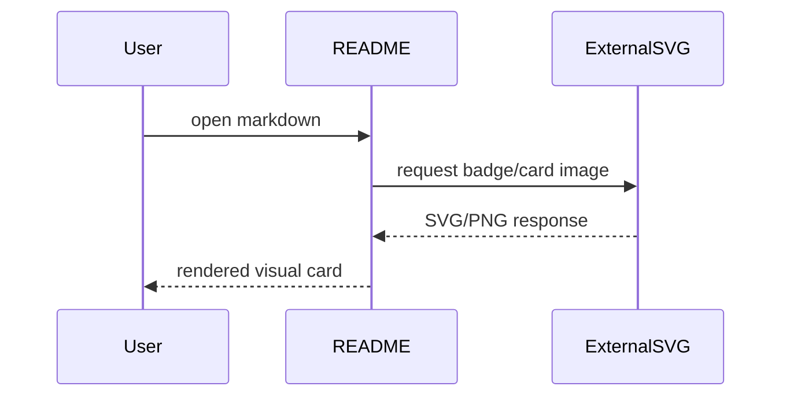

# Markdown Gadget Test Lab

> GitHub README에서 쓸 수 있는 배지, 카드, 그래프, 이미지, 애니메이션, 접기 UI, Mermaid 다이어그램 등을 한곳에 모아둔 테스트 파일입니다.
>
> 일부 이미지는 외부 동적 서비스에 의존하므로 GitHub/서비스 상태, 캐시, rate limit에 따라 잠시 안 보일 수 있습니다.

<p align="center">
  
</p>

<p align="center">
  <a href="https://github.com/Jungoari"></a>
  
  
  
</p>

---

## 1. Shields.io 배지

Shields.io는 README에서 가장 많이 쓰는 작은 상태 박스입니다. Prusa-Enclosure의 `status work in progress` 같은 느낌을 만들 때 좋습니다.


```md


```

---

## 2. GitHub Readme Stats 카드

동적으로 GitHub 통계와 언어 비율을 보여주는 카드입니다.

<p align="center">
  
  
</p>

```md


```

---

## 3. GitHub Streak 카드

연속 contribution streak를 보여주는 카드입니다.

<p align="center">
  
</p>

```md

```

---

## 4. Activity Graph

최근 GitHub 활동 그래프입니다. README 하단에 넣으면 포트폴리오 느낌이 납니다.

<p align="center">
  
</p>

```md

```

---

## 5. Trophy 카드

GitHub 활동을 트로피처럼 보여주는 장식입니다.

<p align="center">
  
</p>

```md

```

---

## 6. Repository Pin 카드

특정 레포를 카드처럼 꽂아둘 수 있습니다.

<p align="center">
  <a href="https://github.com/Jungoari/Prusa-Enclosure">
    
  </a>
  <a href="https://github.com/Jungoari/CAN-RS4">
    
  </a>
</p>

---

## 7. Capsule Render 헤더/푸터

README 맨 위나 아래에 웨이브, 실린더, blur, gradient 같은 큰 SVG 장식을 넣을 수 있습니다.

<p align="center">
  
</p>

```md

```

---

## 8. 움직이는 텍스트 / Typing SVG

타이핑되는 것처럼 보이는 SVG입니다.

<p align="center">
  
</p>

---

## 9. HTML 정렬과 이미지 카드

GitHub Markdown은 일부 HTML을 허용합니다. `p align`, `img width`, `picture` 태그를 활용할 수 있습니다.

<p align="center">
  <a href="https://github.com/Jungoari/Prusa-Enclosure">
    
  </a>
</p>

<p align="center"><sub>이미지를 클릭하면 Prusa-Enclosure 레포로 이동합니다.</sub></p>

---

## 10. Details / 접기 UI

길이가 긴 설명, 설치법, 로그, 코드 등을 접어서 숨길 수 있습니다.

<details>
<summary><strong>클릭해서 Prusa-Enclosure 설명 펼치기</strong></summary>

- Prusa MK3S 기반 커스텀 인클로저
- Klipper 전환
- HEPA + 활성탄 필터
- PMS7003 / SGP30 / DHT22 센서
- OLED 대시보드
- 센서 데이터 기반 노즐 막힘 조기 감지 실험

</details>

```md
<details>
<summary>펼치기</summary>
숨겨진 내용
</details>
```

---

## 11. Mermaid 다이어그램

GitHub는 Mermaid 다이어그램 렌더링을 지원합니다. 프로젝트 구조, 데이터 흐름, 상태 전이를 문서화할 때 좋습니다.





---

## 12. GitHub 기본 Markdown 체크리스트

- [x] Badge 테스트
- [x] Stats 카드 테스트
- [x] Activity graph 테스트
- [x] Mermaid 테스트
- [ ] 실제 프로필 README에 적용할 항목 선별
- [ ] Prusa-Enclosure README에 어울리는 장식만 추려서 반영

---

## 13. 표 + 이모지 + 링크 카드 느낌

| Feature | Use Case | Example |
|---|---|---|
| 🛡️ Shields | 상태/버전/기술스택 | `status`, `license`, `last commit` |
| 📊 Stats | GitHub 계정 통계 | GitHub Readme Stats |
| 🔥 Streak | 꾸준함 강조 | Streak Stats |
| 📈 Graph | 활동량 시각화 | Activity Graph |
| 🏆 Trophy | 프로필 장식 | GitHub Profile Trophy |
| 🌊 Capsule | 큰 헤더/푸터 | Capsule Render |
| ⌨️ Typing | 움직이는 자기소개 | Readme Typing SVG |
| 🧭 Mermaid | 구조도/흐름도 | flowchart, sequenceDiagram |

---

## 14. Prusa-Enclosure에 바로 쓸 만한 조합 예시

```md
<p align="center">
  
</p>

<p align="center">
  
  
  
  
</p>
```

---

## 15. 주의할 점

- 외부 동적 SVG 서비스는 rate limit이나 장애가 있을 수 있습니다.
- 너무 많은 이미지를 README 첫 화면에 넣으면 로딩이 느려질 수 있습니다.
- 중요한 프로젝트 README에서는 장식보다 정보 구조가 우선입니다.
- API 키, 토큰, 계정번호 등 민감 정보는 절대 badge URL이나 이미지 URL에 넣으면 안 됩니다.

<p align="center">
  
</p>
