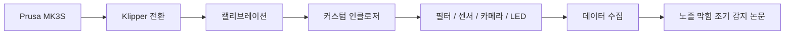
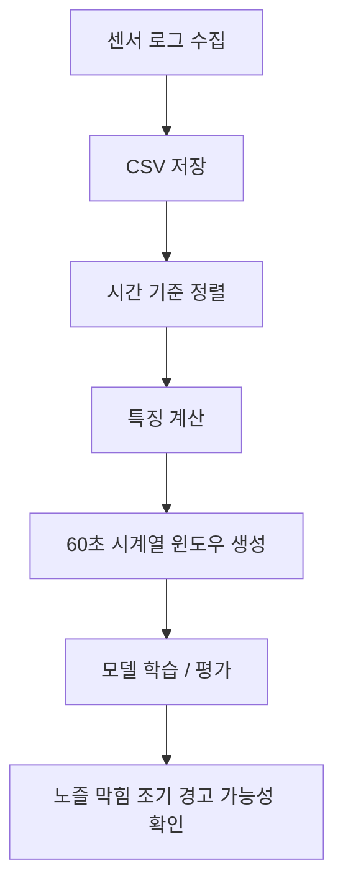

<p align="center">
  
</p>

# Prusa Enclosure V1.0

> **Prusa MK3S를 Klipper 기반 프린터로 다시 구성하고, 직접 제작한 인클로저와 센서 시스템을 더해 3D 프린팅을 더 안정적으로 관찰하고 이해하기 위한 프로젝트입니다.**

<p align="center">
  
  
  
  
  
</p>

<p align="center">
  <a href="README.md">English README</a> ·
  <a href="docs/paper/Choi.J_KCC2026_260430.pdf">최종 논문 PDF</a> ·
  <a href="docs/research_summary.md">연구 요약</a>
</p>

---

## 이 README는 무엇을 보여주나요?

이 프로젝트는 단순히 3D 프린터를 꾸민 기록이 아닙니다.  
중고로 들여온 Prusa MK3S를 다시 이해하고, 직접 고치고, 더 잘 관찰하기 위해 진행한 긴 제작 과정입니다.

크게 세 부분으로 나눌 수 있습니다.

| 구분 | 핵심 질문 | 결과 |
|---|---|---|
| **1. 3D 프린터** | 왜 순정 펌웨어를 Klipper로 바꾸었나? | 더 자유로운 제어, 웹 UI, 세밀한 캘리브레이션, 프린터 구조에 대한 깊은 이해 |
| **2. 인클로저** | 왜 프린터 주변 환경까지 직접 만들었나? | 출력 안정성, 필터링, 카메라/LED/컨트롤 패널, 전시 가능한 완성도 |
| **3. 논문/연구** | 출력 실패를 더 일찍 감지할 수 있을까? | 공기질 센서와 시계열 데이터를 활용한 노즐 막힘 조기 경고 실험 |

> 사진은 나중에 최종 이미지가 정리되면 각 섹션 사이에 삽입할 예정입니다.  
> 현재 문서에는 사진 자리만 남겨두었습니다.

---

## 빠르게 보기



---

# 1. 3D 프린터: 순정에서 Klipper로

## 왜 순정 펌웨어를 바꾸었나요?

Prusa MK3S는 순정 상태에서도 충분히 좋은 프린터입니다.  
하지만 이 프로젝트에서는 단순히 “잘 출력되는 프린터”보다, 내부 동작을 직접 관찰하고 제어할 수 있는 플랫폼이 필요했습니다.

순정 펌웨어는 안정적이지만, 설정을 깊게 바꾸거나 웹 기반으로 상태를 세밀하게 관리하기에는 한계가 있습니다. 반면 Klipper는 Raspberry Pi와 프린터 제어 보드를 함께 사용해 더 유연한 설정과 웹 UI를 제공합니다.

이 전환을 선택한 이유는 크게 네 가지입니다.

- **세밀한 튜닝을 직접 하고 싶었기 때문**  
  가속도, 압출, flow, pressure advance, bed mesh 같은 값을 더 자유롭게 조정할 수 있습니다.

- **웹 UI 기반의 프린터 관리가 필요했기 때문**  
  Fluidd/Mainsail 같은 UI를 통해 출력 상태를 브라우저에서 확인하고 제어할 수 있습니다.

- **인클로저와 대시보드에 어울리는 시각적 인터페이스를 만들고 싶었기 때문**  
  단순한 LCD보다 웹 대시보드가 프로젝트의 완성도를 더 잘 보여줍니다.

- **프린터를 제대로 이해하고 싶었기 때문**  
  보드를 바꾸고 배선을 다시 잡는 과정에서 모터, 팬, 히터, 센서가 어떻게 연결되고 동작하는지 직접 배울 수 있었습니다.

> **사진 삽입 예정:** 순정 보드 / SKR Mini E3 V3.0 / 배선 라벨링 / Klipper 웹 UI

---

## 어떤 작업을 했나요?

기존 Prusa MK3S의 순정 보드와 Marlin 기반 환경을 내리고, Klipper 기반 구성을 새로 만들었습니다.

진행한 작업은 다음과 같습니다.

- 기존 제어 보드 제거
- **SKR Mini E3 V3.0** 보드 장착
- 모터, 센서, 팬, 히터 배선 재정리
- 커넥터 규격 차이 때문에 JST 커넥터 재압착
- 각 배선 라벨링
- Raspberry Pi에 Klipper 설치
- 웹 UI 환경 구성
- 보드 펌웨어 빌드 및 플래싱
- 프린터 설정 파일 작성 및 수정

이 과정에서 가장 많이 느낀 점은, 펌웨어 교체가 단순히 소프트웨어를 바꾸는 일이 아니라는 것입니다.  
실제로는 프린터를 여러 번 분해하고 조립하면서 하드웨어와 소프트웨어를 동시에 맞춰가는 작업에 가까웠습니다.

---

## 캘리브레이션: 계속 실패하고, 조금씩 나아진 과정

Klipper로 바꾼 뒤 바로 좋은 출력물이 나오지는 않았습니다.  
오히려 처음에는 모터가 제대로 움직이지 않거나, 팬 전압이 맞지 않아 타는 냄새가 나거나, 슬라이서 설정이 맞지 않아 G-code 오류가 발생했습니다.

진행한 캘리브레이션은 다음과 같습니다.

| 작업 | 왜 필요한가 | 좋아진 점 |
|---|---|---|
| 모터 방향/배선 확인 | 축이 의도한 방향으로 움직여야 함 | 프린터가 안정적으로 홈 위치를 찾기 시작함 |
| PID 튜닝 | 노즐/베드 온도를 안정적으로 유지 | 온도 흔들림과 가열 오류 감소 |
| Extruder rotation distance | 명령한 길이만큼 실제 필라멘트가 나오도록 보정 | 과압출/저압출 문제를 줄임 |
| Z offset | 노즐과 베드 사이 간격 조정 | 첫 레이어 품질 개선 |
| Bed mesh | 베드의 높낮이 차이를 보정 | 위치별 첫 레이어 편차 감소 |
| Flow rate | 실제 벽 두께와 압출량 보정 | 표면 품질과 치수 안정성 개선 |
| Pressure advance | 압출 압력 변화 보정 | 코너/가감속 구간 품질 개선 가능성 확인 |

특히 flow rate와 Z offset은 여러 번 반복해야 했습니다.  
처음에는 벽 두께가 기준보다 훨씬 두껍게 나왔고, first layer도 한쪽은 높고 다른 쪽은 낮았습니다. 하지만 계속 측정하고 수정하면서 점점 의도한 값에 가까워졌습니다.

이 과정의 의미는 단순히 “출력이 됐다”가 아닙니다.  
문제가 생겼을 때 어디를 의심해야 하는지, 하나의 실패가 배선·온도·슬라이서·기계 조립 중 어디에서 왔는지 구분하는 감각이 생겼다는 점이 더 중요했습니다.

> **사진 삽입 예정:** 실패한 Benchy / first layer / flow cube / bed mesh / 노즐 교체 / 툴헤드 재조립

---

# 2. 인클로저: 프린터를 하나의 시스템으로 만들기

## 왜 인클로저를 만들었나요?

처음에는 프린터를 보호하고 보기 좋게 배치하기 위한 목적이 컸습니다.  
하지만 작업이 진행될수록 인클로저는 단순한 외관 부품이 아니라, 출력 환경을 일정하게 만들고 센서를 설치하며 실험 데이터를 수집하기 위한 공간이 되었습니다.

인클로저를 만든 이유는 다음과 같습니다.

- 출력 중 외부 환경 영향을 줄이기 위해
- 필라멘트와 전자부품을 더 깔끔하게 배치하기 위해
- 카메라, LED, 컨트롤 패널을 통합하기 위해
- 필터와 센서 챔버를 설치하기 위해
- 전시나 발표에서 프로젝트를 한눈에 보여주기 위해

---

## 프레임: 두 개의 공간으로 나눈 구조

인클로저는 크게 하단 출력 공간과 상단 보조 공간으로 나누었습니다.

- **하단:** Prusa MK3S가 실제로 출력하는 공간
- **상단:** 필라멘트, 배선, 전자부품, 향후 습도 제어를 고려한 공간

이렇게 나눈 이유는 단순합니다.  
프린터만 박스 안에 넣는 것보다, 필라멘트·센서·제어부·공기 흐름까지 함께 생각해야 장기적으로 관리하기 편하기 때문입니다.

프레임은 제작 가능한 재료와 비용을 고려해 선택했고, 필요한 브라켓과 고정 부품은 직접 모델링하거나 출력했습니다.

> **사진 삽입 예정:** 전체 프레임 / 상하단 구조 / 커스텀 브라켓 / 조립 과정

---

## 필터: 냄새와 입자를 그냥 밖으로 보내지 않기 위해

FDM 프린팅은 소재와 조건에 따라 냄새, VOC, 미세입자 문제가 생길 수 있습니다.  
이 프로젝트에서는 HEPA 필터와 활성탄 필터를 사용해 내부 공기를 순환시키는 구조를 만들었습니다.

필터 구조의 목적은 두 가지입니다.

1. **실제 사용 환경 개선**  
   출력 중 발생할 수 있는 냄새와 입자를 줄이고 싶었습니다.

2. **연구용 센서 비교**  
   필터 전후의 공기질 차이를 측정하면, 출력 중 발생하는 환경 변화를 데이터로 볼 수 있습니다.

이 덕분에 인클로저는 단순한 박스가 아니라, 공기 흐름을 제어하고 측정하는 실험 공간이 되었습니다.

> **사진 삽입 예정:** HEPA + 활성탄 필터 / 필터 경로 / 센서 전후 위치

---

## 컨트롤 패널: 보기 좋고 관리하기 쉽게

컨트롤 패널은 프로젝트의 얼굴 같은 부분입니다.  
배선과 전자부품을 그냥 숨기는 것이 아니라, 필요한 조작과 표시를 한곳에 모아 관리하기 쉽게 만들고자 했습니다.

컨트롤 패널에는 다음 요소들이 연결될 수 있도록 구성했습니다.

- 전원/상태 표시
- LED 제어
- 센서/대시보드 표시
- Raspberry Pi 기반 웹 UI 또는 로컬 상태 표시
- 유지보수를 위한 접근성

이 부분은 기능뿐 아니라 전시성과도 관련이 있습니다.  
SW 부스나 발표 자리에서 프로젝트를 설명할 때, 컨트롤 패널은 “이 시스템이 실제로 동작한다”는 인상을 주는 핵심 요소가 됩니다.

> **사진 삽입 예정:** 컨트롤 패널 외부 / 내부 배선 / 대시보드 표시

---

## 카메라와 LED: 멀리서도 확인할 수 있게

3D 프린팅은 출력 시간이 길기 때문에, 프린터 앞에 계속 서 있을 수 없습니다.  
그래서 카메라와 LED는 단순한 장식이 아니라 실제 사용성을 높이는 장치입니다.

- 카메라는 출력 상태를 원격으로 확인하기 위한 용도
- LED는 챔버 내부를 밝게 비춰 카메라와 육안 확인을 돕는 용도
- 향후 알림/상태 표시와도 연결 가능

다만 이 프로젝트의 연구 방향은 카메라만으로 실패를 감지하는 것이 아닙니다.  
카메라는 사람이 확인하기 위한 보조 수단이고, 핵심은 센서 데이터로 출력 상태 변화를 읽어내는 것입니다.

> **사진 삽입 예정:** 카메라 장착 위치 / LED 스트립 / 챔버 내부 조명 비교

---

## SW 부스 발표와 외부 공유

이 프로젝트는 제작 과정에서 끝나지 않고, SW 부스 발표와 온라인 공유까지 이어졌습니다.

부스 발표에서는 프린터, 인클로저, 센서 구조, 포스터 자료를 통해 프로젝트를 직접 설명했습니다.  
이 과정은 단순히 결과물을 보여주는 자리가 아니라, “왜 이런 구조를 만들었는지”를 사람들에게 설명하며 프로젝트의 방향을 정리하는 계기가 되었습니다.

또한 Prusa Forum과 Reddit에도 프로젝트를 공유했습니다.

- Prusa Forum에는 프로젝트 소개 글을 게시했습니다.
- Reddit `r/3Dprinting`에는 3D 프린터/인클로저/필터/센서 중심으로 공유하려 했고, 계정 제한 및 reCAPTCHA 문제로 자동화는 중단했습니다.
- Reddit에서는 연구 내용보다 실제 빌드, Klipper 전환, 필터링, 센서 배치에 초점을 맞춘 방향이 더 적합하다고 판단했습니다.

해외 커뮤니티에 공유하려고 하면서, 이 프로젝트가 논문뿐 아니라 실제 3D 프린터 사용자에게도 설명 가능한 형태여야 한다는 점을 다시 느꼈습니다. 그래서 README 역시 너무 기술적인 수식이나 내부 구현만 나열하기보다, 사진과 이야기 흐름을 통해 쉽게 이해되도록 구성하는 것이 중요합니다.

> **사진 삽입 예정:** SW 부스 전시 / 포스터 / Forum 게시 화면 / Reddit 작성 화면 또는 반응 캡처

---

# 3. 논문: 센서 데이터로 출력 실패를 더 일찍 보기

## 왜 논문으로 확장했나요?

처음에는 프린터를 더 잘 쓰기 위한 개조였습니다.  
하지만 인클로저에 센서가 들어가고 데이터가 쌓이면서 새로운 질문이 생겼습니다.

> “노즐이 막히기 시작할 때, 출력물에 문제가 눈으로 보이기 전에 주변 공기질이나 환경 데이터가 먼저 변하지 않을까?”

카메라 기반 감지는 직관적이지만 조명, 각도, 가림, 렌즈 오염 같은 영향을 많이 받습니다.  
그래서 이 프로젝트는 공기질 센서와 프린터 상태 데이터를 함께 사용해 조기 경고 가능성을 실험했습니다.

---

## 수집한 데이터

센서 시스템은 1초 단위로 데이터를 수집하는 구조로 설계했습니다.

사용한 주요 데이터는 다음과 같습니다.

| 데이터 | 의미 |
|---|---|
| PM1.0 / PM2.5 / PM10 | 출력 중 발생할 수 있는 미세입자 변화 |
| TVOC / eCO2 | 냄새/VOC 계열 변화 추정 |
| 온도 / 습도 | 센서 보정과 출력 환경 해석에 필요 |
| 필터 전후 차이 | 공기 흐름과 필터 효과 비교 |
| 프린터 메타데이터 | 출력 진행 상태와 센서값을 함께 해석하기 위함 |

공유 폴더에는 센서 로그 CSV와 Python 스크립트가 정리되어 있습니다.  
이번 정리본 기준으로 데이터는 `03_데이터_로그`, 스크립트는 `04_스크립트_코드`에 분류했습니다.

> **사진 삽입 예정:** 센서 로그 CSV 일부 / Python 스크립트 구조 / 데이터 플로우 그림

---

## 센서 챔버

센서 챔버는 이 프로젝트에서 중요한 역할을 합니다.  
센서를 아무 위치에나 놓으면 값이 들쭉날쭉해질 수 있기 때문에, 필터 전후의 공기가 지나가는 위치에 센서를 배치해 비교할 수 있도록 했습니다.

센서 챔버의 목적은 다음과 같습니다.

- 필터 전 공기와 필터 후 공기를 비교
- 출력 중 공기질 변화 추적
- 온습도 영향을 함께 기록
- 단순 표시가 아니라 연구용 데이터로 활용

이 구조 덕분에 인클로저는 “예쁜 케이스”가 아니라 “측정 가능한 실험 환경”이 되었습니다.

> **사진 삽입 예정:** 센서 챔버 외관 / 내부 센서 모듈 / 필터와 연결된 구조

---

## Python 스크립트와 분석 흐름

데이터 분석은 Python을 중심으로 구성했습니다.

흐름은 단순하게 보면 다음과 같습니다.



분석에서 사용한 핵심 아이디어는 필터 전후 차이입니다.

```text
TVOC_diff  = TVOC_in  - TVOC_out
PM2.5_diff = PM2.5_in - PM2.5_out
```

이 값을 그대로 결론으로 사용하기보다는, 시간에 따라 계속 유지되는지 보고, 여러 센서값을 함께 묶어 시계열로 해석했습니다.

README에서는 복잡한 모델 수식보다 다음 메시지를 전달하는 것이 중요합니다.

> 노즐 막힘은 단순히 출력물이 망가지는 순간만의 문제가 아니라, 그 전부터 주변 환경 신호에 작은 변화로 나타날 수 있다.

---

## 최종 논문 PDF와 KCC 학술대회 발표

이 프로젝트는 최종적으로 KCC 학술대회 발표용 논문으로 정리되었습니다.

- 최종 논문 PDF: `docs/paper/Choi.J_KCC2026_260430.pdf`
- 주제: **다변량 시계열 센서 데이터를 활용한 3D 프린터 실시간 노즐 막힘 탐지**
- 핵심 결과:
  - Accuracy: `0.951085`
  - Precision: `0.946218`
  - Recall: `0.999913`
  - F1-score: `0.972325`
  - ROC AUC: `0.975934`
  - 조기 경고 리드타임: `472초`

이 결과는 “완성된 상용 감지기”라기보다는, 센서 기반 조기 경고가 가능할 수 있다는 프로토타입 결과로 보는 것이 정확합니다.  
특히 recall이 높다는 것은 막힘 의심 상황을 놓치지 않는 방향으로 동작했다는 의미가 있습니다. 다만 오탐을 줄이고, 더 다양한 소재와 출력 조건에서 검증하는 작업은 앞으로 더 필요합니다.

KCC 학술대회 발표는 이 프로젝트를 단순 제작기에서 연구 프로젝트로 확장시키는 중요한 단계였습니다.  
프린터를 만들고 고치는 경험, 인클로저를 제작한 경험, 센서 데이터를 수집한 경험이 하나의 연구 질문으로 이어졌다는 점에서 의미가 있습니다.

> **사진 삽입 예정:** 최종 논문 표지 / KCC 발표 자료 / 발표 포스터 / 결과 그래프

---

# 프로젝트를 통해 좋아진 점

이 프로젝트의 결과를 한 문장으로 말하면 다음과 같습니다.

> 프린터를 “출력만 하는 기계”에서 “상태를 관찰하고 설명할 수 있는 시스템”으로 바꾸었다.

구체적으로 좋아진 점은 다음과 같습니다.

## 프린터 측면

- Klipper 기반으로 더 자유로운 튜닝 가능
- 웹 UI를 통한 관리 편의성 증가
- 캘리브레이션 과정을 통해 출력 문제를 분석하는 능력 향상
- 배선, 팬, 히터, 노즐, 슬라이서 설정 등 프린터 구조 이해도 증가

## 인클로저 측면

- 출력 공간이 더 정돈됨
- 카메라/LED/컨트롤 패널로 사용성 향상
- 필터 구조로 공기질 관리 가능성 확보
- 전시와 발표에서 보여주기 좋은 형태로 발전

## 연구 측면

- 센서 데이터를 실제 출력 상태와 연결
- 노즐 막힘 조기 경고 가능성 확인
- Python 분석 파이프라인 구축
- KCC 학술대회 발표와 논문으로 정리

---

# 앞으로 추가할 내용

- [ ] 각 섹션별 대표 사진 삽입
- [ ] 최종 wiring diagram 정리
- [ ] Klipper 설정 파일 설명 보강
- [ ] 센서 챔버 구조도 추가
- [ ] KCC 발표 자료/포스터 링크 정리
- [ ] Reddit/Forum 외부 반응 정리
- [ ] 영어 README도 같은 구조로 개편

---

# 파일 구조 예시

향후 실제 `Prusa-Enclosure` 레포는 다음처럼 정리하면 읽는 사람이 이해하기 쉽습니다.

```text
Prusa-Enclosure/
├─ README.ko.md                 # 한국어 소개
├─ README.md                    # 영어 소개
├─ docs/
│  ├─ printer/                  # Klipper 전환, 캘리브레이션
│  ├─ enclosure/                # 프레임, 필터, 패널, 카메라, LED
│  ├─ research/                 # 센서 데이터, 분석, 논문
│  ├─ paper/                    # 최종 논문 PDF
│  └─ images/                   # 최종 선별 이미지
├─ scripts/                     # 데이터 수집/분석 Python 스크립트
├─ data/                        # 샘플 데이터 또는 예시 로그
├─ config/                      # Klipper/Moonraker 예시 설정
└─ hardware/                    # 3D 모델, G-code, BOM 등
```

---

# 마무리

이 프로젝트는 처음부터 완벽하게 계획된 연구가 아니었습니다.  
프린터를 고치고, 보드를 바꾸고, 캘리브레이션을 반복하고, 인클로저를 만들고, 센서를 달고, 데이터를 모으다 보니 자연스럽게 하나의 연구 질문으로 이어졌습니다.

그래서 이 README는 단순한 기능 목록보다, 다음 흐름을 보여주는 것이 중요합니다.

1. 왜 순정 프린터를 바꾸고 싶었는지
2. 바꾸는 과정에서 어떤 문제를 만났는지
3. 인클로저를 통해 무엇을 더 잘 관리하게 되었는지
4. 센서 데이터를 통해 어떤 새로운 가능성을 보았는지
5. 이 경험이 논문과 발표로 어떻게 이어졌는지

이 문서를 읽는 사람이 세부 기술을 모두 알지 못하더라도,  
“아, 이건 프린터를 직접 이해하고 더 나은 시스템으로 발전시킨 프로젝트구나”라고 느끼게 만드는 것이 목표입니다.

<p align="center">
  
</p>
