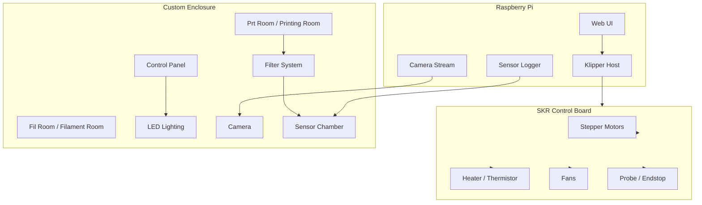

  

# Prusa Enclosure V1.0

> **Prusa MK3S 3D 프린터를 오픈소스 펌웨어 기반으로 개조하고, 직접 제작한 인클로저 챔버와 센서 시스템에 통합한 프로젝트입니다.**
>
> 단순한 외형 개조가 아니라, 프린터의 제어 방식과 출력 환경을 직접 재구성하고, 이를 센서 기반 연구와 학술 발표까지 확장한 작업입니다.

  
  
  
  
  
  

  <a href="README.md">English README</a> ·
  <a href="docs/paper/Choi.J_KCC2026_260430.pdf">최종 논문 PDF</a> ·
  <a href="docs/research_summary.md">연구 요약</a>

---

## 프로젝트 설명

이 프로젝트는 **Prusa MK3S 3D 프린터**를 오픈소스 펌웨어 기반으로 개조하고, 직접 제작한 **인클로저 챔버**에 통합한 프로젝트입니다. 핵심은 순정 펌웨어와 기존 제어 구조를 **Klipper 기반 구조**로 변경하고, 원격 제어, 카메라 모니터링, LED 조명, 필터 구조, 센서 데이터 수집 환경을 하나의 시스템으로 구성한 것입니다.

즉, 이 프로젝트는 단순히 프린터 외형을 꾸미는 작업이 아닙니다. 프린터가 어떻게 움직이고, 어떻게 출력 환경을 유지하며, 출력 중 어떤 데이터가 발생하는지까지 직접 다루기 위해 **3D 프린터의 제어 방식과 출력 환경을 재구성한 프로젝트**입니다.

---

## 키워드

  
  
  
  
  

  
  
  
  
  

  
  
  
  
  

---

## 만든 이유

기존 순정 펌웨어를 사용하는 Prusa MK3S는 실제로 장시간 출력 작업을 반복하면서 여러 불편함이 있었습니다. 출력 파일을 사용하기 위해 매번 SD 카드에 G-code를 저장하고, 카드를 직접 프린터에 꽂아야 했습니다. 또한 출력 중 상태를 확인하거나 문제가 생겼을 때 원격으로 대응하기 어렵다는 한계가 있었습니다.

3D 프린팅 작업은 몇 시간에서 길게는 하루 이상 이어지는 경우가 많습니다. 따라서 프린터 앞에 계속 서 있지 않아도 네트워크를 통해 출력 상태를 확인하고, 필요할 때 프린터를 제어할 수 있는 구조가 필요했습니다.

이를 해결하기 위해 기존 순정 펌웨어 대신 **Klipper**라는 오픈소스 펌웨어를 적용했습니다. Klipper는 Raspberry Pi와 제어 보드를 함께 사용하는 구조입니다. 기존 보드에서는 G-code 해석과 실제 물리적인 모터 제어를 하나의 보드가 모두 처리했다면, Klipper 환경에서는 **G-code 해석과 연산은 Raspberry Pi가 담당하고, 실제 모터 제어는 SKR 보드가 담당**합니다. 이 구조를 통해 기존보다 더 유연하고 부드러운 제어가 가능해졌습니다.

또한 Klipper는 설정 파일을 통해 프린터의 세부 동작을 직접 수정할 수 있습니다. 순정 펌웨어에서는 제한적으로만 접근할 수 있었던 PID 튜닝, Z offset, bed mesh, pressure advance, 모터 방향, 센서 설정, 팬 제어 등의 요소를 직접 조정할 수 있었습니다. Raspberry Pi에서 Klipper가 호스트 프로세스로 동작하기 때문에, 카메라 스트리밍, 센서 데이터 수집, 대시보드, 알림 시스템 같은 기능을 프린터와 연동하기에도 유리했습니다.

> **사진 삽입 예정:** SD 카드 기반 출력 방식 / Klipper 웹 UI / Raspberry Pi와 SKR 보드 연결 구조

---

## 프로젝트 개요

이 프로젝트는 크게 세 부분으로 구성됩니다.

| 구분 | 내용 | 왜 했는가 | 결과 |
|---|---|---|---|
| **1. 3D 프린터 개조** | 순정 펌웨어와 제어 보드를 Klipper 기반으로 재구성 | 원격 제어, 세밀한 튜닝, 프린터 구조 이해 | 네트워크 업로드, 웹 UI 제어, 캘리브레이션 자유도 확보 |
| **2. 자작 인클로저 챔버** | 프레임, 필터, 카메라, LED, 컨트롤 패널, 센서 챔버 통합 | 출력 환경 안정화와 사용성 향상 | 프린터를 하나의 관리 가능한 시스템으로 구성 |
| **3. 센서 기반 연구** | 공기질/환경 데이터 수집 및 Python 분석 | 노즐 막힘을 더 일찍 감지할 수 있는지 확인 | KCC 학술대회 논문 및 발표로 확장 |

---

## 전체 아키텍처

전체 시스템은 Raspberry Pi, SKR 제어 보드, Prusa MK3S 본체, 자작 인클로저, 카메라 모듈, LED, 필터 시스템, 센서 챔버, 컨트롤 패널로 구성했습니다.

Raspberry Pi는 Klipper의 호스트 역할을 하며 G-code 처리, 웹 UI, 네트워크 접근, 추가 센서 연동을 담당합니다. SKR 보드는 Raspberry Pi로부터 명령을 받아 실제 스텝모터, 히터, 팬, 프로브, 서미스터 등을 제어합니다.

프린터 본체는 인클로저 하단의 출력 공간에 배치했고, 상단에는 필라멘트 보관 공간, 필터, 배선, 제어부가 들어가도록 설계했습니다. 카메라와 LED는 출력 상태를 원격으로 확인하기 위해 추가했고, 센서 시스템은 공기질 변화와 출력 상태를 함께 분석하기 위한 데이터 수집 장치로 사용했습니다.

> **사진 삽입 예정:** 전체 시스템 구성도 / 실제 인클로저 내부 배치 / Raspberry Pi와 제어 보드 연결

---

# 1. 3D 프린터 펌웨어 교체

## 순정 펌웨어의 한계

SD 카드 기반 출력 방식은 번거로웠고, 출력 상태를 원격으로 확인하기 어려웠으며, 펌웨어 내부 설정을 세밀하게 수정하는 데 한계가 있었습니다. 특히 장시간 출력에서는 중간 상태 확인과 원격 대응이 중요했지만, 순정 구조만으로는 이를 유연하게 구성하기 어려웠습니다.

Klipper로 전환하면서 G-code를 네트워크로 업로드할 수 있게 되었고, 웹 UI에서 출력 시작, 정지, 온도 확인, 이동 제어, 설정 변경이 가능해졌습니다. 또한 프린터의 움직임과 압출 특성을 더 세밀하게 튜닝할 수 있게 되었습니다.

---

## 보드 교체와 배선 작업

이 과정에서 기존 제어 보드를 **SKR 보드**로 교체했고, Raspberry Pi와 SKR 보드를 연결해 Klipper 환경을 구성했습니다. 보드 교체 과정에서는 모터, 히터, 서미스터, 프로브, 팬, 엔드스톱 등 프린터의 주요 배선을 다시 확인했습니다.

특히 2상 스텝모터의 코일 쌍을 확인하고 올바르게 연결하는 작업이 필요했습니다. 커넥터 규격이 맞지 않는 부분은 JST 커넥터를 새로 압착해 연결했고, 유지보수를 위해 각 배선에 라벨링을 진행했습니다.

| 작업 | 이유 | 결과 |
|---|---|---|
| 순정 보드 제거 | Klipper 기반 구조로 전환하기 위해 | SKR 보드 중심 제어 구조 확보 |
| SKR 보드 장착 | 더 자유로운 펌웨어 설정과 제어를 위해 | Raspberry Pi + SKR 구조 구성 |
| 모터 코일 쌍 확인 | 스텝모터가 정상적으로 회전하려면 필수 | 축 이동 오류 해결 |
| JST 커넥터 재압착 | 기존 커넥터와 새 보드 규격이 맞지 않음 | 안정적인 배선 연결 |
| 배선 라벨링 | 유지보수와 디버깅 편의성 확보 | 추후 수정과 점검이 쉬워짐 |

> **사진 삽입 예정:** 보드 교체 전후 / JST 커넥터 압착 / 라벨링된 배선 / SKR 보드 핀맵

---

## Klipper 세팅과 캘리브레이션

펌웨어 전환 이후에는 캘리브레이션 작업을 진행했습니다. 모터 방향, 센서리스 홈, 프로브 동작, 히터와 서미스터 연결 상태를 확인했고, PID 튜닝을 통해 노즐과 베드 온도를 안정화했습니다.

이후 extruder rotation distance를 보정해 실제 압출량을 맞췄고, Z offset과 bed mesh를 조정해 첫 레이어 품질을 개선했습니다. 슬라이서 설정도 Klipper 환경에 맞게 수정했으며, flow rate와 pressure advance 값도 테스트 출력물을 반복하며 조정했습니다.

| 캘리브레이션 | 목적 | 좋아진 점 |
|---|---|---|
| 모터 방향 확인 | 축이 명령한 방향으로 움직이는지 확인 | 기본 동작 안정화 |
| 센서리스 홈 설정 | 축 원점 탐색 동작 확인 | 홈 위치 탐색 가능 |
| 프로브 동작 확인 | Z 기준점 측정 | 첫 레이어 기준 확보 |
| PID 튜닝 | 노즐/베드 온도 안정화 | 온도 흔들림 감소 |
| Extruder rotation distance | 실제 압출량 보정 | 과압출/저압출 개선 |
| Z offset | 노즐과 베드 사이 간격 조정 | 첫 레이어 품질 개선 |
| Bed mesh | 베드 평탄도 보정 | 위치별 높이 편차 보정 |
| Flow rate | 출력 벽 두께와 압출량 보정 | 표면 품질과 치수 개선 |
| Pressure advance | 압출 압력 변화 보정 | 코너와 가감속 구간 품질 개선 |
| Slicer 설정 수정 | Klipper에 맞는 G-code 생성 | 출력 오류 감소 |

노즐은 기존 Prusa 노즐에서 **Bambu 계열 노즐**로 교체했습니다. 노즐이 바뀌면 압출 특성, 온도 반응, 출력 품질에 영향을 줄 수 있기 때문에, 교체 이후에도 다시 보정 작업을 진행했습니다.

이 과정을 통해 2상 스텝모터의 기본적인 연결부터 보드 배선, 센서 입력, 히터 제어, 펌웨어 설정, 슬라이서 설정, 캘리브레이션, 실제 출력 품질까지 프린터 제어에 필요한 주요 요소를 직접 다뤘습니다.

> **사진 삽입 예정:** PID 튜닝 화면 / Z offset 조정 / Bed mesh / Flow cube / Pressure advance 테스트 / Bambu 노즐 교체

---

# 2. 자작 인클로저 챔버 제작

## 제작 목적

인클로저는 프린터의 출력 환경을 일정하게 유지하고 여러 기능을 통합하기 위한 챔버로 제작했습니다. 3D 프린터는 주변 온도, 공기 흐름, 습도, 먼지, 필라멘트 상태에 따라 출력 품질이 달라질 수 있습니다. 특히 장시간 출력에서는 출력 환경을 일정하게 유지하는 것이 중요했습니다.

인클로저 제작 목적은 다음과 같습니다.

| 목적 | 설명 |
|---|---|
| 출력 환경 유지 | 주변 온도와 공기 흐름의 영향을 줄이고 장시간 출력을 안정화 |
| 카메라 모니터링 | 프린터 앞에 계속 있지 않아도 출력 상태 확인 |
| LED 조명 | 야간 출력과 카메라 확인 보조 |
| 필라멘트 보관 | 상단 공간을 활용해 필라멘트와 전장부 정리 |
| 유해 입자/냄새 제어 | 필터 구조를 통해 냄새와 입자 저감 가능성 확보 |
| 센서 연구 | 노즐 막힘 현상 연구를 위한 공기질 데이터 수집 |
| 전시/발표 | 프로젝트 구조를 한눈에 보여줄 수 있는 외형과 패널 구성 |

---

## Prt Room과 Fil Room

인클로저는 크게 두 개의 공간으로 나누었습니다. 하단은 실제 프린터가 출력하는 **Prt Room**이고, 상단은 필라멘트, 필터, 전자부품, 배선이 들어가는 **Fil Room**입니다.

| 공간 | 역할 | 설계 이유 |
|---|---|---|
| **Prt Room** | 실제 출력 공간 | 출력 중 온도와 공기 흐름을 안정적으로 유지하기 위해 |
| **Fil Room** | 필라멘트, 필터, 전장부, 배선 공간 | 유지보수성과 확장성을 확보하기 위해 |

하단 공간은 출력 중 온도와 공기 흐름을 안정적으로 유지하는 데 집중했고, 상단 공간은 필라멘트 습도 관리, 필터 시스템, 제어부 배치를 위한 공간으로 사용했습니다.

> **사진 삽입 예정:** 하단 Prt Room / 상단 Fil Room / 전체 인클로저 단면 또는 구조 사진

---

## 프레임과 외장 구조

프레임은 **3030 알루미늄 프로파일**을 사용해 제작했습니다. 필요한 크기를 계산한 뒤 프로파일 견적과 재단을 진행했고, 폴리카보네이트 판을 재단해 외벽을 구성했습니다. 틈새를 줄이기 위해 고무 가스켓과 실리콘 마감을 적용했습니다. 고정이 필요한 부분에는 직접 모델링한 브라켓을 출력해 사용했고, 일부 마감과 패널에는 포맥스를 사용했습니다.

| 구성 요소 | 사용 이유 | 효과 |
|---|---|---|
| 3030 알루미늄 프로파일 | 튼튼하고 조립/수정이 쉬움 | 챔버 기본 골격 구성 |
| 폴리카보네이트 판 | 내부 확인 가능, 가공 가능 | 외벽과 투명 패널 구성 |
| 고무 가스켓 | 틈새 감소 | 공기 흐름과 밀폐성 개선 |
| 실리콘 마감 | 틈새 보완 | 냄새/공기 누출 저감 |
| 출력 브라켓 | 필요한 형상을 직접 제작 | 구조물 고정과 커스텀 가능성 확보 |
| 포맥스 패널 | 가볍고 가공이 쉬움 | 마감과 패널 구성에 활용 |

> **사진 삽입 예정:** 3030 프로파일 / 폴리카보네이트 판 / 가스켓 / 실리콘 마감 / 출력 브라켓 / 포맥스 패널

---

## 카메라와 LED

카메라 모듈은 출력 상태를 원격으로 확인하기 위해 장착했습니다. 카메라를 통해 웹 UI나 스트리밍 화면에서 출력 상태를 확인할 수 있도록 구성했습니다. 내부가 어두운 환경에서도 출력 상태를 볼 수 있도록 LED도 함께 적용했습니다.

| 구성 요소 | 역할 | 좋아진 점 |
|---|---|---|
| 카메라 모듈 | 출력 상태 원격 확인 | 프린터 앞에 없어도 상태 확인 가능 |
| LED 조명 | 챔버 내부 조명 | 야간 출력과 카메라 시야 개선 |
| 웹 UI 연동 | 브라우저에서 상태 확인 | 출력 관리 편의성 증가 |

LED는 야간 출력 확인과 카메라 모니터링을 보조하는 역할을 했습니다. 단순한 장식이 아니라, 장시간 출력 중 문제를 빠르게 확인하기 위한 실용적인 장치입니다.

> **사진 삽입 예정:** 카메라 장착 위치 / LED 스트립 / 조명 전후 비교 / 웹 UI 카메라 화면

---

## DIN 레일과 내부 전장 정리

인클로저 내부에는 **DIN 레일**을 장착했습니다. 전원부, 제어부, 배선, 모듈 등을 정리해 고정하기 위한 구조였습니다. 프로젝트가 진행되면서 배선과 모듈이 늘어났기 때문에, DIN 레일을 통해 내부 전장부를 정돈된 형태로 배치했습니다.

| 구성 요소 | 역할 | 효과 |
|---|---|---|
| DIN 레일 | 전장 부품 고정 | 내부 구조 정돈 |
| 전원부 정리 | 전원 공급 안정화 | 유지보수 편의성 향상 |
| 배선 정리 | 케이블 흐름 관리 | 문제 발생 시 추적 쉬움 |
| 모듈 고정 | 센서/제어 모듈 배치 | 확장성과 안정성 확보 |

> **사진 삽입 예정:** DIN 레일 / 전장부 배치 / 배선 정리 전후

---

## 필터 구조

3D 프린팅 과정에서는 소재와 출력 조건에 따라 냄새, VOC, 미세입자 등이 발생할 수 있습니다. 이를 제어하기 위해 인클로저 내부 공기를 필터를 통해 순환시키는 구조를 고려했습니다.

필터는 냄새와 입자 제어를 위한 장치이면서, 동시에 필터 전후의 공기질 데이터를 비교하기 위한 연구 구조로도 사용했습니다.

| 구성 요소 | 역할 | 의미 |
|---|---|---|
| HEPA 필터 | 미세입자 저감 | 출력 중 입자 관리 가능성 확보 |
| 활성탄 필터 | 냄새/VOC 저감 | 챔버 내부 공기질 개선 |
| 순환 팬 | 내부 공기 이동 | 필터를 통한 공기 흐름 형성 |
| 필터 전후 센서 | 공기질 비교 | 연구 데이터 수집 기반 |

> **사진 삽입 예정:** 필터 모듈 / HEPA + 활성탄 필터 / 공기 흐름 경로 / 필터 전후 센서 위치

---

## 컨트롤 패널

컨트롤 패널은 **전투기 조종 패널**에서 영감을 받아 모델링했습니다. 각 공간의 습도나 상태 정보를 7세그먼트 디스플레이로 표시하고, 0.96인치 OLED 모듈을 사용해 추가 정보를 보여줄 수 있도록 구성했습니다. 제어부에는 Arduino Mega를 사용했습니다.

컨트롤 패널은 조작부이자 상태 표시 장치이며, 부스 전시나 발표에서 프로젝트 구조를 직관적으로 보여주는 요소로 사용했습니다.

| 구성 요소 | 역할 | 기대 효과 |
|---|---|---|
| 7세그먼트 디스플레이 | 공간별 수치 표시 | 멀리서도 상태 확인 가능 |
| 0.96인치 OLED | 추가 정보 표시 | 세부 상태 표시 가능 |
| Arduino Mega | 패널 제어 | 여러 디스플레이/입출력 제어 |
| 스위치/버튼류 | 조작 인터페이스 | 물리적인 조작감과 전시성 확보 |
| 전투기 패널 스타일 | 디자인 컨셉 | 프로젝트의 시각적 인상 강화 |

> **사진 삽입 예정:** 컨트롤 패널 외형 / 내부 배선 / 7세그먼트 / OLED / Arduino Mega

---

# 3. 관련 연구 및 발표

## 센서 데이터 기반 연구로 확장

이 프로젝트는 인클로저 제작에서 끝나지 않고, 센서 데이터를 활용한 연구로 이어졌습니다. 인클로저 내부에 센서를 설치하고 데이터를 수집하면서, 노즐 막힘 현상을 공기질 및 환경 데이터 변화로 조기에 탐지할 수 있는지 확인하고자 했습니다.

이를 위해 인클로저 내부와 필터 구조 주변에서 데이터를 수집했습니다. 주요 데이터는 미세먼지, TVOC, eCO2, 온도, 습도 등이었습니다. 센서 데이터는 일정 시간 간격으로 저장했고, 이후 Python 스크립트를 사용해 CSV 데이터를 정리하고 분석했습니다.

분석 과정에서는 순간적인 센서값 하나만 보는 것이 아니라, 시간에 따른 변화와 필터 전후 차이, 출력 상태와의 관계를 함께 다뤘습니다.

| 데이터 | 의미 | 활용 |
|---|---|---|
| PM1.0 / PM2.5 / PM10 | 미세입자 변화 | 출력 중 입자 발생 패턴 확인 |
| TVOC | 휘발성 유기화합물 변화 | 소재/출력 상태 변화 관찰 |
| eCO2 | 공기질 지표 | 챔버 내부 환경 변화 참고 |
| 온도 | 챔버 환경 | 센서값 해석과 출력 조건 확인 |
| 습도 | 필라멘트/센서 영향 | TVOC 센서 해석 보조 |
| 필터 전후 차이 | 공기 흐름과 필터 효과 | 연구용 특징값 생성 |

> **사진 삽입 예정:** 센서 로그 CSV / Python 스크립트 / 데이터 그래프 / 필터 전후 비교

---

## 센서 챔버

센서 챔버는 인클로저 내부 공기 흐름을 측정하기 위한 핵심 구조입니다. 단순히 센서를 프린터 옆에 두는 것이 아니라, 필터 전후의 공기질 변화를 비교할 수 있도록 센서 위치를 구성했습니다.

| 요소 | 설명 |
|---|---|
| 센서 챔버 | 센서가 안정적으로 공기 흐름을 측정하도록 만든 공간 |
| 필터 전 센서 | 필터를 통과하기 전 공기질 측정 |
| 필터 후 센서 | 필터를 통과한 뒤 공기질 측정 |
| 비교 데이터 | 필터 효과와 출력 중 변화 분석에 사용 |

이 구조 덕분에 인클로저는 단순한 케이스가 아니라, 출력 환경을 측정할 수 있는 실험 장치가 되었습니다.

> **사진 삽입 예정:** 센서 챔버 외형 / 센서 모듈 / 필터와 연결된 구조 / 공기 흐름 방향

---

## Python 분석 스크립트

수집한 데이터는 Python 스크립트로 정리하고 분석했습니다. CSV 데이터를 읽고, 시간 기준으로 정렬한 뒤, 센서값의 변화와 필터 전후 차이를 계산했습니다.

분석에서 중요한 점은 단일 센서값만 보는 것이 아니라 여러 센서값을 함께 보고, 시간에 따라 이어지는 패턴을 확인하는 것입니다. 이 때문에 논문에서는 다변량 시계열 데이터를 활용했습니다.

---

## 논문과 KCC 학술대회 발표

논문에서는 **다변량 시계열 센서 데이터를 활용해 3D 프린터의 노즐 막힘 현상을 조기에 탐지하는 방법**을 다뤘습니다.

카메라 기반 감지는 조명, 각도, 가림, 렌즈 오염 같은 외부 조건에 영향을 받을 수 있습니다. 반면 공기질과 환경 센서 데이터는 출력 중 발생하는 미세한 변화를 다른 방식으로 포착할 수 있습니다. 이 연구에서는 센서 기반으로 출력 실패를 조기에 감지할 수 있는 가능성을 확인하는 데 초점을 두었습니다.

최종적으로 수집한 데이터, Python 분석 스크립트, 센서 챔버 구조, 실험 결과를 논문으로 정리했고, **KCC 학술대회 발표**로 이어졌습니다. 최종 논문 PDF와 발표 자료는 프로젝트의 연구 결과물로 정리했습니다.

| 항목 | 내용 |
|---|---|
| 논문 주제 | 다변량 시계열 센서 데이터를 활용한 3D 프린터 노즐 막힘 탐지 |
| 데이터 | 공기질, 온도, 습도, 필터 전후 차이 |
| 분석 도구 | Python 스크립트, CSV 전처리, 시계열 특징 추출 |
| 연구 목적 | 출력 실패를 시각적으로 드러나기 전에 조기 탐지할 수 있는지 확인 |
| 결과물 | 최종 논문 PDF, 발표 자료, KCC 학술대회 발표 |

> **사진 삽입 예정:** 최종 논문 PDF 표지 / KCC 발표 자료 / 발표 포스터 / 결과 그래프

---

# 4. 부스 전시

이 프로젝트는 부스 전시를 통해 외부에 소개했습니다. 부스에서는 Prusa MK3S 본체, 자작 인클로저, 컨트롤 패널, 센서 구조, 발표 자료를 함께 보여주었습니다.

전시에서는 Klipper 기반 프린터 개조 과정, 인클로저 제작 목적, 센서 기반 노즐 막힘 연구 흐름을 중심으로 프로젝트를 설명했습니다. 실제 하드웨어가 함께 있었기 때문에, 단순한 코드나 논문보다 프로젝트의 구조를 직관적으로 전달할 수 있었습니다.

| 전시 요소 | 설명 |
|---|---|
| Prusa MK3S 본체 | 개조된 프린터 플랫폼 |
| 자작 인클로저 | 프린터와 센서/필터/제어부가 통합된 챔버 |
| 컨트롤 패널 | 상태 표시와 조작부 |
| 센서 구조 | 공기질 데이터 수집 장치 |
| 발표 자료 | 프로젝트 배경과 연구 결과 설명 |

> **사진 삽입 예정:** 부스 전시 사진 / 포스터 / 컨트롤 패널 시연 / 관람객 설명 장면

---

# 5. Reddit 및 해외 반응

프로젝트는 Reddit과 해외 3D 프린팅 커뮤니티에도 공유했습니다. 공유 내용은 Klipper 전환, 자작 인클로저 구조, 필터 시스템, 컨트롤 패널, 센서 기반 연구를 중심으로 구성했습니다.

해외 커뮤니티에서는 연구 내용만 강조하기보다, 실제 빌드 과정과 프린터 개조 요소를 중심으로 소개하는 것이 더 적합하다고 판단했습니다. 그래서 Reddit용 글은 논문보다 3D 프린터, 인클로저, Klipper, 필터, 센서 배치에 초점을 맞춰 작성했습니다.

| 공유 위치 | 중심 내용 | 비고 |
|---|---|---|
| Prusa Forum | Prusa MK3S 개조, 인클로저, Klipper, 센서 구조 | 프로젝트 소개 글 게시 |
| Reddit r/3Dprinting | 실제 빌드, 필터, 센서, Klipper 전환 | 계정 제한/reCAPTCHA 문제로 자동화 중단 |
| 해외 3D 프린팅 커뮤니티 | 사용자 관점의 피드백 기대 | 기계 구조와 실사용성 중심 |

> **사진 삽입 예정:** Prusa Forum 게시 화면 / Reddit 작성 화면 / 해외 커뮤니티 반응 캡처

---

# 6. 아쉬운 점과 개선 방향

아쉬운 점은 추후 실제 개선 사항을 기준으로 정리할 예정입니다. 현재 기준에서는 배선 정리, 센서 위치, 필터 구조, 컨트롤 패널 구성, 데이터 수집 조건, 실험 반복 횟수 등을 중심으로 보완할 수 있습니다. 다만 이 항목은 실제 사진과 최종 구조를 함께 확인한 뒤 작성하는 것이 적절합니다.

| 항목 | 현재 아쉬운 점 | 개선 방향 |
|---|---|---|
| 배선 정리 | 기능이 늘어나며 내부 배선이 복잡해짐 | DIN 레일과 라벨링 기준 보강 |
| 센서 위치 | 공기 흐름에 따라 값이 달라질 수 있음 | 센서 위치별 비교 실험 추가 |
| 필터 구조 | 실제 필터 효율 검증이 더 필요 | 필터 전후 장기 데이터 비교 |
| 컨트롤 패널 | 기능과 디자인을 계속 확장 중 | 표시 정보와 조작부 정리 |
| 데이터 수집 조건 | 소재/출력 조건 반복 수가 제한적 | 다양한 소재와 출력 조건에서 재수집 |
| 연구 검증 | 더 많은 ground truth 필요 | 실제 막힘 시점 라벨링 강화 |

---

# 7. 프로젝트를 통해 좋아진 점

이 프로젝트의 가장 큰 결과는 프린터를 단순한 출력 장치가 아니라, **원격으로 제어하고, 환경을 관리하며, 데이터를 수집할 수 있는 시스템**으로 바꾸었다는 점입니다.

| 영역 | 좋아진 점 |
|---|---|
| 프린터 제어 | SD 카드 의존도를 줄이고 웹 UI 기반 제어 가능 |
| 캘리브레이션 | PID, Z offset, bed mesh, flow rate 등 세부 튜닝 가능 |
| 출력 환경 | 인클로저를 통해 외부 환경 영향을 줄이고 관리 가능 |
| 모니터링 | 카메라와 LED로 원격 확인 편의성 증가 |
| 유지보수 | 배선 라벨링, DIN 레일, 컨트롤 패널로 구조 정리 |
| 연구 확장 | 센서 데이터를 활용해 노즐 막힘 조기 탐지 연구로 연결 |
| 발표/공유 | 부스 전시, 논문, 해외 커뮤니티 공유로 확장 |

---

## 앞으로 추가할 내용

- [ ] 각 섹션별 최종 사진 삽입
- [ ] 전체 wiring diagram 정리
- [ ] Klipper 설정 파일 설명 보강
- [ ] 센서 챔버 구조도 추가
- [ ] 컨트롤 패널 회로/코드 정리
- [ ] KCC 발표 자료와 최종 논문 링크 정리
- [ ] Reddit/Forum 반응 정리
- [ ] 영어 README도 같은 구조로 개편

---

## 마무리

이 프로젝트는 처음부터 완성된 설계도를 가지고 시작한 작업이 아니었습니다. 장시간 출력의 불편함을 줄이고 싶어서 Klipper로 전환했고, 출력 환경을 더 잘 관리하고 싶어서 인클로저를 만들었고, 센서 데이터를 모으다 보니 노즐 막힘 연구로 이어졌습니다.

그래서 이 README가 보여주고 싶은 핵심은 단순한 부품 목록이 아닙니다.

> **프린터를 직접 이해하고, 고치고, 환경을 만들고, 데이터를 수집하며, 하나의 연구 주제로 발전시킨 과정**입니다.

  

